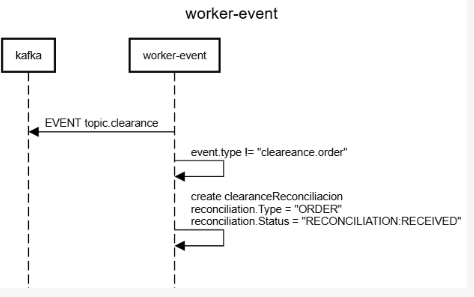

## go-worker-event

   This is workload for POC purpose such as load stress test, gitaction, event driven subjects, etc.

   The main purpose is consume the kafka messages from clearance topic and create a reconciliation data.

   Despite the workload is a event driven there is 2 http endpoints exposed just for observability purpose (metrics). 

## Sequence Diagram

    title worker-event

    participant kafka
    participant worker-event
    
    entryspacing 0.7
        postData
        queryData
    space
    kafka<-worker-event:EVENT topic.clearance
    worker-event->worker-event:create clearanceReconciliacion\nreconciliation.Type = "ORDER"\nreconciliation.Status = "RECONCILIATION:RECEIVED"

## Endpoints

curl --location 'http://localhost:7007/info'

curl --location 'http://localhost:7007/metrics'

## Monitoring

Logs: JSON structured logging via zerolog

Metrics: Available through endpoint /metrics via otel/sdk/metric

Trace: The x-request-id is extract from header and is ingest into context, in order the x-request-id do not exist a new one is generated (uuid)

Errors: Structured error handling with custom error types

## Enviroment variables

   To run in local machine for local tests creat a .env in /cmd folder

    VERSION=1.0
    ACCOUNT=aws:localhost
    APP_NAME=go-worker-event.localhost
    PORT=7007
    ENV=dev

    DB_HOST= 127.0.0.1 
    DB_PORT=5432
    DB_NAME=postgres
    DB_MAX_CONNECTION=30
    CTX_TIMEOUT=10

    LOG_LEVEL=info #info, error, warning
    OTEL_EXPORTER_OTLP_ENDPOINT = localhost:4317

    OTEL_METRICS=true
    OTEL_STDOUT_TRACER=false
    OTEL_TRACES=true

    OTEL_LOGS=true
    OTEL_STDOUT_LOG_GROUP=true
    LOG_GROUP=/mnt/c/Eliezer/log/go-worker-event.log

    KAFKA_USER=admin
    KAFKA_PASSWORD=admin
    KAFKA_PROTOCOL=SASL_SSL
    KAFKA_MECHANISM=SCRAM-SHA-512
    KAFKA_CLIENT_ID=GO-WORKER-EVENT-LOCAL
    KAFKA_BROKER_1=b-1.mskarch01.x25pj7.c3.kafka.us-east-2.amazonaws.com:9096 
    KAFKA_BROKER_2=b-3.mskarch01.x25pj7.c3.kafka.us-east-2.amazonaws.com:9096 
    KAFKA_BROKER_3=b-2.mskarch01.x25pj7.c3.kafka.us-east-2.amazonaws.com:9096
    KAFKA_PARTITION=3
    KAFKA_REPLICATION=1
    KAFKA_GROUP_ID=GROUP-WORKER-EVENT-LOCAL
    TOPIC_EVENT=topic.clearance.local

## Table

    CREATE TABLE order_clearance_reconciliacion (
        id 						BIGSERIAL		NOT NULL,
        transaction_id			VARCHAR(100) 	NULL,        
        reconciliacion_type 	VARCHAR(100) 	NULL,
        reconciliacion_status 	VARCHAR(100) 	NULL,
        reconciliacion_currency VARCHAR(100) 	NULL,
        reconciliacion_amount 	DECIMAL(10,2) 	NOT null DEFAULT 0,
        fk_clearance_id			BIGINT			NULL,
        clearance_status 		VARCHAR(100) 	NULL,
        clearance_currency 		VARCHAR(100) 	NULL,
        clearance_amount 		DECIMAL(10,2) 	NOT null DEFAULT 0,
        fk_order_id				BIGINT			NULL,
        order_status 			VARCHAR(100) 	NULL,
        order_currency 			VARCHAR(100) 	NULL,
        order_amount 			DECIMAL(10,2) 	NOT null DEFAULT 0,
        created_at 				timestamptz 	NOT NULL,
        updated_at 				timestamptz  	NULL,
        CONSTRAINT order_clearance_reconciliacion_pkey PRIMARY KEY (id)
    );
